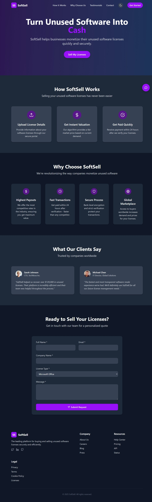

# SoftSell - Software License Resale Platform

 <!-- Add screenshot later -->

A responsive single-page marketing website for a fictional software resale startup, built with React and Tailwind CSS.

## 📌 Features

- **Modern UI/UX Design**
  - Clean, professional interface
  - Fully responsive layout
  - Dark/light mode toggle
  - Smooth animations and transitions

- **Complete Sections**
  - Hero section with compelling CTA
  - "How It Works" process visualization
  - "Why Choose Us" value propositions
  - Customer testimonials
  - Contact form with validation

- **Technical Highlights**
  - Built with React + Vite
  - Tailwind CSS for styling
  - Framer Motion for animations
  - Responsive design (mobile-first)
  - Dark mode persistence using localStorage

## 📌 Bonus Features

✅ AI-powered chat widget (mock implementation)  
✅ SEO optimized with meta tags  
✅ Custom favicon and logo placeholder  
✅ Smooth scroll animations  
✅ Responsive navigation menu  
✅ Form validation  

## 📌 Technologies Used

- **Frontend**
  - React.js
  - Vite
  - Tailwind CSS
  - Framer Motion
  - React Icons

## 📌 Installation

1. Clone the repository:
   ```bash
   git clone https://github.com/your-username/softsell.git

2. Navigate to the project directory:
   ```bash
    cd softsell

3. Install dependencies:
   ```bash
    npm install

4. Start the development server:
   ```bash
    npm run dev

5. Open your browser at:
    ```bash
    http://localhost:5173

6. Build for Production
    ```bash
    npm run build

## 📌 Deployment
The project is configured for easy deployment to:
- Vercel
- Netlify
- GitHub Pages

🔗[Live Demo](https://softsell-web.netlify.app/)

## 📌 Project Structure
```bash
src/
├── components/          # React components
├── context/             # Theme context provider
├── App.jsx              # Main application
├── main.jsx             # Entry point
└── index.css            # Tailwind CSS
```

## 📌 Design Choices
- Color Scheme: Purple/blue gradient with neutral backgrounds
- Typography: Clean, modern Inter font
- Animations: Subtle but purposeful motion effects
- Dark Mode: Full support with system preference detection

## 📌 Time Spent
- Planning & Design: 2 hours
- Development: 6 hours
- Testing & Polish: 2 hours
- Documentation: 10 min

## 📌 Future Improvements
- Add real backend integration
- Implement actual AI chat functionality
- Add more interactive elements
- Include analytics

## 📌 License
MIT License - Feel free to use as a template for your projects


